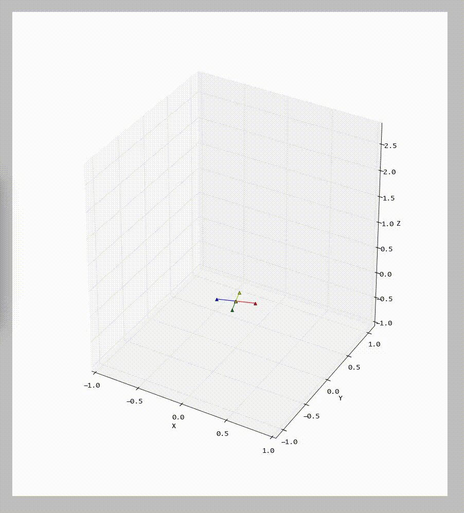

## High Speed Quadrotor flips Learning

### Installation
```
pip install requirements.txt
```

### Running
The `multi_flips.py` script can be used to perform cmaes optimization or generate matplotlib flight plots or generate data for blender.
```
usage: multi_flips.py [-h] [-f [F]] [--fly | --cmaes | --blender]

Quadcopter multiflips

optional arguments:
  -h, --help  show this help message and exit
  -f [F]      Parameters file to generate output
  --fly       Plot the flight
  --cmaes     Run cmaes optimization
  --blender   Generate data for blender
 
--fly and --blender take a file as an argument that can be used to provide optimized parameters (Ex: example.params). If the
file is not provided default initial parameters will be used.
```
### Matplotlib Plot
Using `--fly` will generate a matplotlib animated plot as below


### Blender Animation
An animated plot using blender can be generated by the following steps

1. Generate the data using `--blender -f example.params`
2. Open `quadcopter.blend` in blender and paste `render.py` into blender and set the appropiate path for the 
state data `quaddata.npy` file generated in the first step in the code pasted in to blender.

Example Output: [Blender Flight Path Video](https://youtu.be/aoSr-yHOgnQ)

### References
1. A Simple Learning Strategy for High-Speed Quadrocopter Multi-Flips
 - Sergei Lupashin, Angela Sch ̈ollig, Michael Sherback, Raffaello D’Andrea
2. Adaptive Open-Loop Aerobatic Maneuvers for Quadrocopters
 - Sergei Lupashin, Rafaello D’Andrea
3. Adaptive fast open-loop maneuvers for quadrocopters
 - Sergei Lupashin, Rafaello D’Andrea
